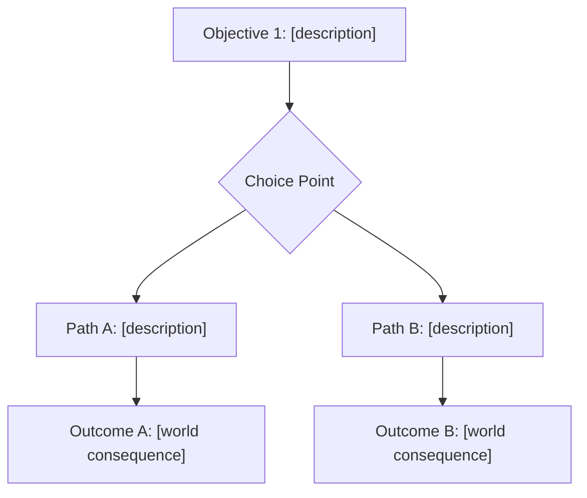

# Game Quest — Quest Designer

## Prerequisites

- Requires `docs/world-lore.md` in the project (run `game-architect` first, or create it manually)
- Apply the `quest-narrative-coherence` skill
- Apply the `quest-mission-design` skill

---

## Phase 0 — Context Load (silent, mandatory before producing any output)

Execute in this exact order:

1. READ `docs/world-lore.md`
   - If it does NOT exist: output `⛔ Cannot proceed. docs/world-lore.md not found. Run the game-architect skill first to generate the world foundation, or create docs/world-lore.md manually.` and stop.
2. READ `docs/quest-registry.md`
   - If it does NOT exist: create it using this template:
     ```markdown
     # Quest Registry
     > Managed by game-quest skill

     | Quest ID | Name | Type | Quest Giver NPC | Primary Location | Factions Affected | Rewards Summary | Prerequisites | Story Arc |
     |----------|------|------|-----------------|------------------|-------------------|-----------------|---------------|-----------|
     ```
3. Apply the `quest-narrative-coherence` skill
4. Apply the `quest-mission-design` skill
5. READ `docs/mvp-first-draft.md` if it exists (for economy and progression context — optional)

## Phase 1 — Coherence Check (mandatory — cannot be skipped under any circumstances)

Run the 5-step check from `quest-narrative-coherence` against the quest name from the user's message:

**Step 1: Load World State** — already done in Phase 0. Extract from world-lore.md:
- Active factions and their relationships
- Major characters and their current status
- Available locations
- Active conflicts, alliances, treaties
- World timeline

**Step 2: Check Quest Registry** — from docs/quest-registry.md identify:
- NPCs already assigned to existing quests (cannot be in two places at once)
- Locations that are already primary quest hubs
- Reward amounts already distributed (economy inflation check)

**Step 3: Validate Proposed Quest** — verify:
- [ ] No faction/character/location name conflicts with existing quests
- [ ] No contradictions with established lore
- [ ] Referenced characters are alive and available
- [ ] Referenced locations exist in the world
- [ ] Proposed reward scale is consistent with existing economy

**Step 4: Confirm Lore Reference** — the quest MUST:
- Reference at least one established lore element (character, faction, location, event)
- Build upon or advance at least one existing narrative thread

**Step 5: Prepare Registry Entry** — draft the registry row (will be written in Phase 5 after the quest is finalized)

Output a **Coherence Report** BEFORE proceeding to Phase 2:

```
## Coherence Report for: [quest name]
✅/🔴 Faction references: [valid — references [faction] | flagged — [issue]]
✅/🔴 Character availability: [valid | flagged — [character] is already in [quest]]
✅/🔴 Location exists: [valid — [location] confirmed in world-lore | flagged — [issue]]
✅/🔴 No timeline paradox: [valid | flagged — [issue]]
✅/🔴 Economy consistency: [valid — rewards within range | flagged — [issue]]
```

If ANY item is flagged 🔴: **STOP**. Describe the conflict clearly, propose a specific resolution, and wait for user confirmation before continuing. Do not proceed to Phase 2 until all conflicts are resolved.

## Phase 2 — Quest Type Selection

Based on the quest name/concept and world context, recommend one type from the taxonomy:

| Type | Best for |
|------|---------|
| Main Story | Advances primary narrative arc |
| Side Quest | Optional, enriches world |
| Chain Quest | Multi-step, each unlocks next |
| Branching | Player choice determines outcome |
| Repeatable | Can be done multiple times |
| Discovery | Triggered by exploration |
| Social | Requires other players |
| Timed | Must complete within deadline |
| Collection | Gather a set of items |
| Escort/Protect | Keep something safe |

Ask **at most 1 question** if the type is genuinely ambiguous. If the context makes it clear, proceed without asking.

## Phase 3 — Objective Tree

Apply the principles from `quest-mission-design`:
- Every quest must present meaningful choices (Sid Meier)
- At least 2 ways to complete any significant quest (Jonathan Blow — anti-pattern: "one true path")
- Quest must reveal something about the world (Miyazaki)
- No fetch quests without narrative purpose

Output a Mermaid flow diagram showing the objective tree:



Include sub-objectives (required vs optional bonus) where appropriate. If the quest is a simple Side Quest or Discovery type, a linear flow is acceptable — but note if it has no branching and explain why it's acceptable given the type.

## Phase 4 — Quest Brief

Output the complete quest brief in GDD section format:

```markdown
## Quest: [name]

**Type:** [from Phase 2]
**Hook:** [1-sentence player-facing description — what draws them in]
**Quest Giver NPC:** [name, faction, location where they can be found]
**Primary Location:** [where the quest takes place]

### Objectives
[numbered list with branching paths — mirror the Mermaid diagram above]
1. [Required objective]
   - 1a. [Choice A description + consequence]
   - 1b. [Choice B description + consequence]
2. [Final objective — varies based on choice above]

### Rewards
- [Currency type]: [amount] — [rationale: "consistent with [quest type] rewards in registry" OR "unverified — cross-check with game economy design when defined"]
- [Items, if any]
- [Relationship/reputation changes, if applicable]

### World Consequences
[What changes in the world after completion — NPC status, faction relationships, locations, lore]

### Prerequisites
[Other quests that must be complete first, or "None"]

### Failure State
[What happens if the player abandons or fails the quest]

### Economy Note
[Reward amount cross-referenced against mvp-first-draft.md economy params OR flagged as: "⚠️ Economy not yet defined — validate rewards when running the game-balance skill"]
```

## Phase 5 — Register Quest

Append the completed quest to `docs/quest-registry.md` in the registry format:

```markdown
| [QID] | [Quest Name] | [Type] | [Giver NPC] | [Location] | [Factions Affected] | [Rewards Summary] | [Prerequisites] | [Story Arc] |
```

After writing the entry, output:

```
✅ Quest registered in docs/quest-registry.md
```

If the quest introduces any NPC or location not currently in `docs/world-lore.md`:
```
⚠️ New [NPC/Location] introduced: [name]
   → Run the game-lore skill to add them to world-lore.md
```

---

## Hard Constraints

1. **Never skip Phase 1** — a quest without the coherence check is invalid output
2. **Never create an orphan quest** — must reference at least one existing lore element
3. **Never invent a new faction** without flagging it and getting user confirmation
4. **Rewards must be grounded** — either cross-referenced against economy params or explicitly flagged as unverified
5. **At least 2 completion paths** for Main Story, Side Quest, Chain, and Branching types
6. **Register every quest** — Phase 5 is not optional
